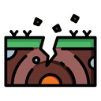
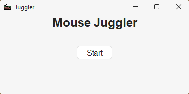

# Juggler - Mouse Automation Tool 🖱️



[](https://github.com/kumarsatish23/Juggler/blob/main/ReadMe.md#%EF%B8%8F-installation)


Juggler is a lightweight desktop application that automates mouse movements and switches between windows, simulating activity on your computer. Whether you need to prevent your system from going idle or want to keep programs active, Juggler is here to help.

---

## ⚠️ **Caution**

> **Important:**  
This tool is intended as a fun and educational project. While it can prevent your system from idling, misusing it may lead to ethical concerns or disciplinary action, especially in professional settings.  
Ensure that you use this application responsibly and with full integrity. I do not endorse using this for moonlighting, daydreaming, or any activity that undermines your obligations to your employer or work commitments.  

---

## 🚀 Features

- **Automated Mouse Movement:** Simulates natural mouse movements to prevent the system from idling.
- **Window Switching:** Randomly switches between open windows to simulate activity.
- **Customizable Interface:** Clean and modern UI inspired by macOS, powered by FlatLaf.
- **Lightweight & Portable:** Available as a portable executable for easy setup.

---

## 🛠️ Installation

### Windows
1. **Download the Application**:
   - [Juggler.exe](Installers/Juggler.exe): Standalone executable Installer Method.
   - [JugglerPortable.zip](Installers/JugglerPortable.zip): Portable version Non Installer Method.

2. **Run the Application**:
   - Double-click `Juggler.exe` to launch the application.
   - For the portable version, extract the `JugglerPortable.zip` and run `Juggler.exe`.

### Maven (For Developers)
1. Clone this repository:
   ```bash
   git clone https://github.com/username/juggler.git
   cd juggler
   ```
2. Build using Maven:
   ```bash
   mvn package
   ```
3. Run the application:
   ```bash
   java -jar target/Juggler.jar
   ```

---

## 📜 Usage

1. Launch the application.
2. Click the **Start** button to begin mouse automation.
3. Click the **Stop** button to halt the automation.

> Note: The app uses a splash screen at startup. Please allow a few seconds for it to load.

---

## 📂 Project Structure

```
Juggler
├── .gitignore
├── Juggler.exe
├── JugglerPortable.zip
├── pom.xml
├── src
│   ├── main
│   │   ├── java
│   │   │   └── in
│   │   │       └── vanna
│   │   │           └── Main.java
│   │   └── resources
│   │       ├── Juggler.ico
│   │       ├── Juggler.png
│   │       └── OMUNMO0.png
│   └── test
│       └── java
└── .idea
```

---

## 📷 Screenshots



---

## 🔧 Built With

- **Java**: Core programming language.
- **Swing**: For GUI components.
- **FlatLaf**: Modern, flat Look and Feel.
- **Maven**: Build and dependency management.

---

## 🛡️ License

This project is licensed under the MIT License. See the `LICENSE` file for more details.

---

## 💡 Contributing

Contributions are welcome! Here's how you can help:
1. Fork the repository.
2. Create a feature branch: `git checkout -b feature-name`.
3. Commit your changes: `git commit -m 'Add some feature'`.
4. Push to the branch: `git push origin feature-name`.
5. Open a Pull Request.

---

## 📨 Contact

For questions or support, reach out via:
- LinkedIn: [Satish Kumar Rai](https://www.linkedin.com/in/kumarsatish23/)

---

Made with ❤️ by "Satish Kumar Rai" JSR .
